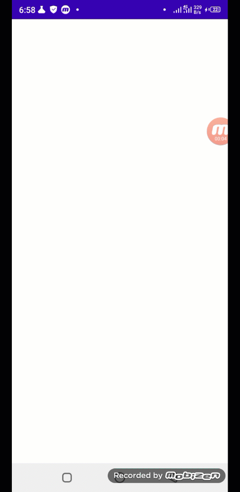

## Super Gauge View


An android Speed/Gauge View purly written in kotlin. It is super simple and you can use it in any project like Internet Test Speed, Android Games or other speed measuring and visualizing purposes.
It has 20 progress bar gradients and super easy to implement in your project.
#### Implementation
##### Step 1
Insert it in your settings.gradle file
```
dependencyResolutionManagement {
    repositoriesMode.set(RepositoriesMode.FAIL_ON_PROJECT_REPOS)
    repositories {
        .......
        ......
        maven { url 'https://jitpack.io' }
        jcenter()
    }
}
```
##### Step 2
include this in module based gradle file
```
implementation 'com.github.farimarwat:Super-Gauge-View:1.0'
```
**Note: Due to another dependency of circularprogressbar, jcenter() is must to include. Otherwise this dependency will not work**

#### XML Attributes and Details
| XML Attribute  |details   |
| ------------ | ------------ |
|  app:duration="500" | Duration(Speed) of moving progress   |
|  app:gaugebottomicon="@drawable/example" |  Set bottom small icon |
| app:gaugeText="Upload"  |  Gauge View Text |
| app:gaugeTextColor="@color/white" | Change bottom gauge text color  |
| app:gaugebottomicon="@drawable/ic_baseline_arrow_circle_down_24" |  Set bottom small icon  |
| app:gaugebottomiconcolor="@color/white"|  Set bottom small icon color  |
| app:progressBackground="gauge_keyhole_7" |  Setting progress background |
|  |   |

#### Methods and Functions
|  Method Name | Method Details   |
| ------------ | ------------ |
| `getDuration()`  | Get speed/duration of moving progress   |
| `setDuration(duration:Long)`  |  Set speed/duration of moving progress |
|  `getGaugeText():String` | Get bottom text   |
| `setGaugeText(value:String)`  | Set bottom text   |
|  `setProgressBackground(background:String)` | To set the progress background e.g. setProgressBackground(SuperGaugeView.GAUGE_KEYHOLE_1). It has 20 gradient backgrounds  |
| `setGaugeBottomIcon(icon:Drawable)`  | Set bottom small icon  |
| `setGaugeBottomIconColor(color: Int)`  | Set bottom small icon color |
| `setProgress(value:Float)`  | Progress must be float and needle will be only rotate up to 120  |
|   |   |

#### Usage
**XML Layout**
```
<com.farimarwat.supergaugeview.SuperGaugeView
        android:id="@+id/mygaugeview"
        android:layout_width="wrap_content"
        android:layout_height="wrap_content"
        app:layout_constraintStart_toStartOf="parent"
        app:layout_constraintEnd_toEndOf="parent"
        app:layout_constraintTop_toTopOf="parent"
        app:layout_constraintBottom_toBottomOf="parent"
        app:gaugeText="Upload Speed"
        app:duration="500"
        app:progressBackground="gauge_keyhole_14"
        app:gaugeTextColor="@color/white"
        />
```
**Listeners**
```
addGaugeListener(object :SuperGaugeView.GaugeListener{
            override fun onProgress(progress: Float) {
                Log.e("TEST","Gauge: ${progress}")
            }
			override fun onGaugePrepared(prepared: Boolean) {
                Log.e("TEST","isPrepared: ${prepared}")
            }
        })
```
**Example**
```
 binding.mygaugeview.prepareGauge(this)
        binding.mygaugeview.addGaugeListener(object :SuperGaugeView.GaugeListener{
            override fun onProgress(progress: Float) {
                Log.e("TEST","Gauge: ${progress}")
            }

            override fun onGaugePrepared(prepared: Boolean) {
                if(prepared){
                    CoroutineScope(Dispatchers.Main).launch {
                      while(true){
                          delay(1000)
                          val progress = (0..121).random()
                          binding.mygaugeview.setProgress(progress.toFloat())
                      }
                    }
                }
            }

        })
```

This is just initial release and may contain any bugs and issues. So if you find any bugs then kindly create an issue or email me at: farimarwat@gmail.com.
My linkedin profile link: https://www.linkedin.com/in/farman-ullah-khan-a02859196/
**If you have any suggestions or want to remove/modify/add features then feel free to contact me**
